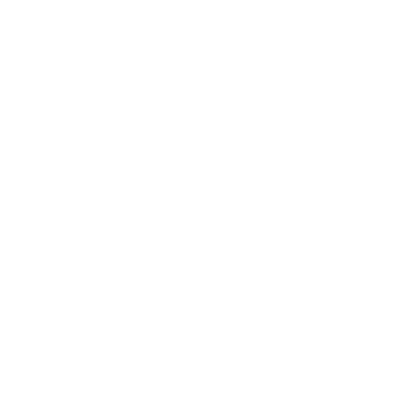
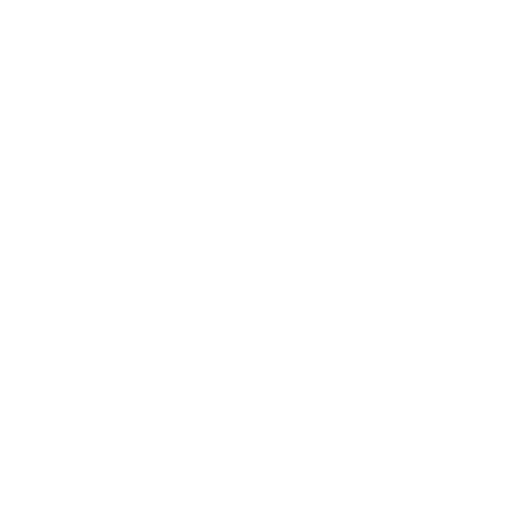

# ローグライク ゲーム設計書

## 1. 敵システム

### 敵データ構造

```rust
pub struct Enemy {
    pub x: i32,
    pub y: i32,
    pub hp: u32,
    pub max_hp: u32,
    pub color: [f32; 3],
    pub name: String,
    pub enemy_type: EnemyType,
    pub variant: EnemyVariant,  // 強度バリアント
    pub atk: u32,
    pub drop_rate: u32,  // ドロップ確率(0-100)
}

#[derive(Clone, Copy, Debug, PartialEq)]
pub enum EnemyType {
    Goblin,
    Skeleton,
    Bat,
    Spider,
    Troll,
    Zombie,
    Ghost,
    Mummy,
    Ogre,
    Wyvern,
    Dragon,
}

#[derive(Clone, Copy, Debug, PartialEq)]
pub enum EnemyVariant {
    Weak,      // 弱体版（薄い色）
    Normal,    // 標準版（基本色）
    Strong,    // 強化版（濃い色）
    Boss,      // ボス版（金色/黒金）
}

impl Enemy {
    pub fn new(enemy_type: EnemyType, variant: EnemyVariant, x: i32, y: i32) -> Self {
        let (name, hp, atk, color, drop_rate) = Self::get_stats(enemy_type, variant);
        Self {
            x,
            y,
            hp,
            max_hp: hp,
            color,
            name,
            enemy_type,
            variant,
            atk,
            drop_rate,
        }
    }

    fn get_stats(
        enemy_type: EnemyType, 
        variant: EnemyVariant
    ) -> (String, u32, u32, [f32; 3], u32) {
        match (enemy_type, variant) {
            // Goblin variants
            (EnemyType::Goblin, EnemyVariant::Weak) => 
                ("Young Goblin".to_string(), 12, 3, [0.6, 1.0, 0.6], 20),
            (EnemyType::Goblin, EnemyVariant::Normal) => 
                ("Goblin".to_string(), 20, 5, [1.0, 1.0, 0.3], 30),
            (EnemyType::Goblin, EnemyVariant::Strong) => 
                ("Hobgoblin".to_string(), 28, 7, [0.3, 0.8, 0.3], 40),
            (EnemyType::Goblin, EnemyVariant::Boss) => 
                ("Goblin Lord".to_string(), 60, 10, [1.0, 0.85, 0.0], 100),

            // Skeleton variants
            (EnemyType::Skeleton, EnemyVariant::Weak) => 
                ("Skeleton".to_string(), 18, 4, [0.9, 0.9, 0.9], 25),
            (EnemyType::Skeleton, EnemyVariant::Normal) => 
                ("Skeleton Warrior".to_string(), 25, 6, [1.0, 1.0, 1.0], 35),
            (EnemyType::Skeleton, EnemyVariant::Strong) => 
                ("Skeleton Knight".to_string(), 35, 9, [0.7, 0.7, 0.8], 45),
            (EnemyType::Skeleton, EnemyVariant::Boss) => 
                ("Skeleton King".to_string(), 70, 13, [0.9, 0.9, 1.0], 100),

            // ... 他の敵タイプも同様に定義
            // Bat, Spider, Troll, Zombie, Ghost, Mummy, Ogre, Wyvern, Dragon

            _ => ("Unknown".to_string(), 1, 1, [1.0, 1.0, 1.0], 0),
        }
    }
}
```

**データテーブル化による最適化：**

```rust
// 敵生成時に使用するマスターテーブル
const ENEMY_MASTER: &[(EnemyType, EnemyVariant, u32, u32)] = &[
    // (敵タイプ, バリアント, 出現開始階, 出現終了階)
    (EnemyType::Goblin, EnemyVariant::Weak, 1, 3),
    (EnemyType::Goblin, EnemyVariant::Normal, 1, 5),
    (EnemyType::Goblin, EnemyVariant::Strong, 3, 7),
    (EnemyType::Skeleton, EnemyVariant::Weak, 3, 6),
    (EnemyType::Skeleton, EnemyVariant::Normal, 3, 8),
    (EnemyType::Skeleton, EnemyVariant::Strong, 6, 12),
    // ... 全敵33種分
];

pub fn spawn_enemy_for_floor(depth: u32) -> EnemyType {
    // 深度に応じて出現可能な敵から選択
    let available = ENEMY_MASTER
        .iter()
        .filter(|(_, _, start, end)| depth >= *start && depth <= *end)
        .collect::<Vec<_>>();
    
    if !available.is_empty() {
        let idx = rand::random::<usize>() % available.len();
        available[idx].0
    } else {
        EnemyType::Goblin
    }
}
```

### 敵タイプ一覧（33種類）

#### ティア1: 弱敵（F1-5）

| # | 敵名 | アイコン | 色 | HP | ATK | ドロップ率 | EXP | レア度 |
|---|------|---------|-----|-----|-----|---------|--------|--------|
| 1-1 | Young Goblin | goblin.png | 薄緑 | 12 | 3 | 20% | 30 | ★ |
| 1-2 | Goblin | goblin.png | 黄色 | 20 | 5 | 30% | 50 | ★ |
| 1-3 | Hobgoblin | goblin.png | 濃緑 | 28 | 7 | 40% | 75 | ★★ |
| 2-1 | Young Bat | bat.png | グレー | 10 | 2 | 15% | 20 | ★ |
| 2-2 | Bat | bat.png | 紫 | 18 | 4 | 25% | 40 | ★ |
| 2-3 | Giant Bat | bat.png | 濃紫 | 26 | 6 | 35% | 65 | ★★ |

#### ティア2: 中敵（F6-15）

| # | 敵名 | アイコン | 色 | HP | ATK | ドロップ率 | EXP | レア度 |
|---|------|---------|-----|-----|-----|---------|--------|--------|
| 3-1 | Skeleton | skeleton-inside.png | 薄白 | 18 | 4 | 25% | 50 | ★ |
| 3-2 | Skeleton Warrior | skeleton-inside.png | 白 | 25 | 6 | 35% | 75 | ★ |
| 3-3 | Skeleton Knight | skeleton-inside.png | 銀色 | 35 | 9 | 45% | 120 | ★★ |
| 4-1 | Spider | spider-alt.png | 茶色 | 22 | 5 | 30% | 70 | ★ |
| 4-2 | Spider | spider-alt.png | オレンジ | 30 | 7 | 40% | 100 | ★ |
| 4-3 | Giant Spider | spider-alt.png | 赤橙 | 40 | 10 | 50% | 150 | ★★ |
| 5-1 | Young Troll | daemon-skull.png | 灰色 | 25 | 6 | 30% | 80 | ★ |
| 5-2 | Troll | daemon-skull.png | 紫 | 35 | 8 | 40% | 120 | ★ |
| 5-3 | Troll King | daemon-skull.png | 濃紫 | 48 | 12 | 50% | 180 | ★★ |

#### ティア3: 強敵（F16-25）

| # | 敵名 | アイコン | 色 | HP | ATK | ドロップ率 | EXP | レア度 |
|---|------|---------|-----|-----|-----|---------|--------|--------|
| 6-1 | Zombie | shambling-zombie.png | 薄緑 | 24 | 5 | 30% | 85 | ★ |
| 6-2 | Zombie | shambling-zombie.png | 緑 | 32 | 7 | 40% | 110 | ★ |
| 6-3 | Zombie Lord | shambling-zombie.png | 濃緑 | 44 | 11 | 50% | 165 | ★★ |
| 7-1 | Spirit | ghost.png | 薄青 | 22 | 5 | 35% | 90 | ★ |
| 7-2 | Ghost | ghost.png | 薄青 | 30 | 7 | 45% | 100 | ★ |
| 7-3 | Phantom | ghost.png | 濃青 | 42 | 11 | 55% | 155 | ★★ |
| 8-1 | Mummy | mummy-head.png | 薄褐色 | 32 | 7 | 40% | 120 | ★ |
| 8-2 | Mummy | mummy-head.png | 黄褐色 | 40 | 9 | 45% | 150 | ★ |
| 8-3 | Pharaoh Mummy | mummy-head.png | 濃褐色 | 52 | 13 | 55% | 200 | ★★ |

#### ティア4: 超強敵（F26-29）

| # | 敵名 | アイコン | 色 | HP | ATK | ドロップ率 | EXP | レア度 |
|---|------|---------|-----|-----|-----|---------|--------|--------|
| 9-1 | Ogre | ogre.png | 薄茶 | 35 | 8 | 40% | 140 | ★ |
| 9-2 | Ogre | ogre.png | 茶色 | 45 | 10 | 50% | 180 | ★ |
| 9-3 | Ogre Warlord | ogre.png | 濃茶 | 58 | 14 | 60% | 250 | ★★★ |
| 10-1 | Wyvern | wyvern.png | 薄赤 | 38 | 9 | 45% | 180 | ★ |
| 10-2 | Wyvern | wyvern.png | 赤 | 50 | 12 | 50% | 220 | ★ |
| 10-3 | Hell Wyvern | wyvern.png | 濃赤 | 65 | 16 | 60% | 300 | ★★★ |

#### ボス敵（F10, F20, F30）

| # | 敵名 | アイコン | 色 | HP | ATK | ドロップ | EXP | 階 |
|---|------|---------|-----|-----|-----|---------|--------|-----|
| 11-1 | **Goblin Lord** | goblin.png | 金緑 | 60 | 10 | 必ずドロップ | 300 | **F10** |
| 11-2 | **Dragon** | dragon-head.png | 金色 | 100 | 15 | 必ずドロップ | 500 | **F20** |
| 11-3 | **Ancient Dragon** | dragon-head.png | 黒金 | 150 | 20 | 必ずドロップ | 800 | **F30** |

**色の工夫：**
- 基本色：敵タイプの識別用
- 弱体色（薄い）：下位バージョン
- 標準色（中）：標準バージョン
- 強化色（濃い/金属色）：上位バージョン
- ボス色（金色/黒金）：ボスの格を示す

### 敵生成ルール

- **出現階範囲内でランダム生成**
- **ボス敵**：F10, F20, F30 の各フロアに必ず出現
- **敵数**：フロアあたり 5-8 体（深さにより増加）
- **スケーリング**：深度が上がるごとに敵が1割強化される可能性

### 敵の行動ルール

- **プレイヤーとの衝突で攻撃**
- **攻撃ダメージ**：ATK値が基本ダメージ
- **被ダメージ表示**：敵がダメージを受けるとシェイクアニメーション

---

## 2. アイテムシステム

### アイテムデータ構造

```rust
#[derive(Clone, Debug)]
pub struct Item {
    pub x: i32,
    pub y: i32,
    pub item_type: ItemType,
    pub name: String,
    pub icon_id: String,  // "health-potion.png" など
}

#[derive(Clone, Copy, Debug, PartialEq)]
pub enum ItemType {
    HealthPotion,
    ManaPotion,
    RoyalPotion,
    PotionOfFortitude,
    GoldCoins,
    SilverCoins,
    SapphireGem,
    FireGem,
    TreasureMap,
    GemNecklace,
    BottledShadow,
    AncientRune,
}

pub enum ItemEffect {
    HealHP(u32),
    HealMP(u32),
    BoostATK { duration: u32, amount: u32 },
    BoostHP { amount: u32 },  // 最大HP増加（永続）
    GainEXP(u32),
    Special(String),
}
```

### アイテム一覧

| # | アイテム名 | アイコン | 効果 | レア度 | ドロップ敵 |
|---|-----------|---------|------|--------|-----------|
| 1 | Health Potion | health-potion.png | HP +20 | ★ | 全敵 |
| 2 | Mana Potion | magic-potion.png | MP +15 | ★★ | Spider, Mummy |
| 3 | Royal Potion | standing-potion.png | HP +40, MP +20 | ★★★ | Ogre, Wyvern, Dragon |
| 4 | Potion of Fortitude | potion-ball.png | 10ターン ATK +3 | ★★ | Troll, Zombie |
| 5 | Gold Coins | coins.png | EXP +10 | ★ | 全敵 |
| 6 | Silver Coins | two-coins.png | EXP +25 | ★★ | Ogre, Wyvern |
| 7 | Sapphire Gem | gems.png | EXP +50 | ★★★ | Dragon |
| 8 | Fire Gem | fire-gem.png | 永続 ATK +5 | ★★★ | Wyvern, Dragon |
| 9 | Treasure Map | treasure-map.png | 次の敵HP可視化 | ★★★ | Dragon |
| 10 | Gem Necklace | gem-necklace.png | 永続 MaxHP +10 | ★★ | Mummy, Ogre |
| 11 | Bottled Shadow | bottled-shadow.png | 5ターン敵ATK -2 | ★★ | Ghost, Zombie |
| 12 | Ancient Rune | spiral-bottle.png | 永続 LvアップEXP -20% | ★★★ | Dragon |

### ドロップルール

```
敵を倒す
  ↓
確率判定（ドロップ率%）
  ├─ 成功 → アイテムドロップ
  │   ├─ 敵の種類から対応アイテムをランダム選択
  │   └─ 敵の座標にアイテムを配置
  └─ 失敗 → ドロップなし
```

#### ドロップ率調整

- **基本**：敵のdrop_rate値に基づく
- **深さボーナス**：深くなるほどドロップ率+5%
- **ボス敵**：必ずドロップ（100%）

#### ドロップ対応表

| 敵タイプ | ドロップ候補 |
|---------|-----------|
| Goblin | Gold Coins, Health Potion |
| Skeleton | Gold Coins, Bottled Shadow |
| Bat | Gold Coins, Health Potion |
| Spider | Mana Potion, Silver Coins, Gem Necklace |
| Troll | Health Potion, Potion of Fortitude, Gold Coins |
| Zombie | Bottled Shadow, Mana Potion, Silver Coins |
| Ghost | Bottled Shadow, Mana Potion, Health Potion |
| Mummy | Gem Necklace, Royal Potion, Silver Coins |
| Ogre | Fire Gem, Royal Potion, Silver Coins |
| Wyvern | Fire Gem, Royal Potion, Sapphire Gem, Silver Coins |
| Dragon | Sapphire Gem, Royal Potion, TreasureMap, AncientRune |

---

## 3. ゲームメカニクス

### アイテム入手時の処理

1. **キャンバスに表示**
   - アイテムアイコンを敵の落ちた位置に表示
   - 敵名の代わりにアイテム名を表示

2. **プレイヤーがアイテムを踏むと**
   - 自動収集（接触で即座に獲得）
   - 効果を適用
   - 画面上部に「Item: 〇〇」と表示

3. **効果の種類**
   - **即時効果**：HP/MP回復、経験値増加、ステータス増加
   - **継続効果**：ターン制のバフ/デバフ
   - **永続効果**：最大HP増加、攻撃力増加、レベルアップEXP削減

### ステータス表示の拡張

**Status タブに追加表示**
- 現在の攻撃力（基本値 + バフ）
- 現在の最大HP（基本値 + 装備効果）
- アクティブなバフ・デバフ（ターン数表示）
- 所持アイテム一覧（最大8個まで表示？）

### 敵とアイテムのアイコン管理

**HTML側**
```html
<!-- 敵アイコン -->

...
<!-- アイテムアイコン -->

...
```

**WASM側**
```rust
fn get_enemy_icon(enemy_type: EnemyType) -> String {
    match enemy_type {
        EnemyType::Goblin => "goblin-icon",
        EnemyType::Skeleton => "skeleton-icon",
        ...
    }
}

fn get_item_icon(item_type: ItemType) -> String {
    match item_type {
        ItemType::HealthPotion => "health-potion-icon",
        ...
    }
}
```

---

## 4. 実装優先順位

### Phase 1: 敵システム拡張
- [ ] EnemyType enum 定義
- [ ] 敵データテーブル作成（11種類）
- [ ] 敵スポーン時にランダム選択
- [ ] 敵の色を敵タイプで決定

### Phase 2: ドロップシステム
- [ ] Item struct 定義
- [ ] ドロップロジック実装
- [ ] アイテム表示（2D キャンバス）
- [ ] アイテム収集ロジック

### Phase 3: アイテム効果
- [ ] HP/MP 回復ポーション
- [ ] 経験値アイテム
- [ ] バフ/デバフ効果
- [ ] 永続効果（ステータスアップ）

### Phase 4: UI/UX
- [ ] 所持アイテム表示
- [ ] バフ/デバフ表示
- [ ] アイテム名表示

### Phase 5: ボス戦
- [ ] ボス出現ロジック（F10, 20, 30）
- [ ] ボスの特別な表示
- [ ] ボス勝利時の演出

---

## 5. データベース構造（WASM側）

```rust
pub struct RoguelikeGame {
    // 既存
    ...
    
    // 新規
    pub items: Vec<Item>,
    pub player_buffs: Vec<PlayerBuff>,  // アクティブなバフ
    pub base_atk: u32,                   // 基本攻撃力
}

pub struct PlayerBuff {
    pub buff_type: BuffType,
    pub duration: u32,  // 残りターン数
    pub value: u32,
}

pub enum BuffType {
    ATKUp(u32),
    DefDown(u32),
}
```

---

## 6. アイコンファイルパス一覧

### 敵アイコン
```
敵アイコン → ./icons/{author}/{icon-name}.png
Goblin    → ./icons/caro-asercion/goblin.png
Skeleton  → ./icons/lorc/skeleton-inside.png
Bat       → ./icons/delapouite/bat.png
Spider    → ./icons/carl-olsen/spider-alt.png
Troll     → ./icons/lorc/daemon-skull.png
Zombie    → ./icons/delapouite/shambling-zombie.png
Ghost     → ./icons/lorc/ghost.png
Mummy     → ./icons/delapouite/mummy-head.png
Ogre      → ./icons/delapouite/ogre.png
Wyvern    → ./icons/lorc/wyvern.png
Dragon    → ./icons/lorc/dragon-head.png
```

### アイテムアイコン
```
Health Potion      → ./icons/delapouite/health-potion.png
Mana Potion        → ./icons/delapouite/magic-potion.png
Royal Potion       → ./icons/lorc/standing-potion.png
Potion of Fortitude → ./icons/lorc/potion-ball.png
Gold Coins         → ./icons/delapouite/coins.png
Silver Coins       → ./icons/delapouite/two-coins.png
Sapphire Gem       → ./icons/lorc/gems.png
Fire Gem           → ./icons/delapouite/fire-gem.png
Treasure Map       → ./icons/lorc/treasure-map.png
Gem Necklace       → ./icons/lorc/gem-necklace.png
Bottled Shadow     → ./icons/delapouite/bottled-shadow.png
Ancient Rune       → ./icons/lorc/spiral-bottle.png
```

---

## 7. 画面表示イメージ

### 2D ゲーム画面

```
┌─────────────────────────┐
│ HP: ███████ MP: ███████ │  ← HP/MP バー
├─────────────────────────┤
│                         │
│  敵: Goblin (HP:20)     │  ← 敵情報
│  プレイヤー [●]        │
│  敵 [G]  敵 [G]        │
│                         │
│  Item: Gold Coins ✨     │  ← ドロップアイテム表示
│                         │
└─────────────────────────┘
```

### Status タブ拡張

```
LV: 5
DEPTH: F12
─────────────────
ステータス
攻撃力: 8 (+3)      ← バフ中
最大HP: 60 (+10)    ← 装備効果
─────────────────
アクティブ効果
ATK +3 (3ターン)
─────────────────
所持アイテム
□ Health Potion
□ Gold Coins
□ Fire Gem
```

---

## 8. 装備システム

### 武器（Weapons）

| 武器名 | アイコン | 攻撃力 | 特効 | 入手方法 |
|--------|---------|--------|------|---------|
| Wooden Sword | ancient-sword.png | +3 | なし | 初期装備 |
| Iron Sword | ancient-sword.png | +5 | なし | ドロップ |
| Axe | axe-in-log.png | +7 | 敵HP多い時ダメ+20% | ドロップ |
| Cursed Blade | broken-axe.png | +9 | 自分HP-1/ターン, ダメ+30% | レア ドロップ |
| Dragon Slayer | ancient-sword.png | +12 | ドラゴン系敵へ+50% | ボス ドロップ |

### 防具（Armor）

| 防具名 | アイコン | 防御力 | 効果 | 入手方法 |
|--------|---------|--------|------|---------|
| Leather Armor | belt-armor.png | +2 | なし | ドロップ |
| Chain Mail | chest-armor.png | +4 | なし | ドロップ |
| Steel Plate | abdominal-armor.png | +6 | 移動速度-10% | ドロップ |
| Dragon Scale | cape-armor.png | +8 | 火属性耐性+20% | ボス ドロップ |
| Cursed Mail | armor-punch.png | +10 | 敵ダメ+20%, 防御+10 | レア ドロップ |

### アクセサリー（Accessories）

| アイテム名 | アイコン | 効果 | 入手方法 |
|-----------|---------|------|---------|
| Gold Ring | diamond-ring.png | ゴールド獲得+20% | ドロップ |
| Vampire Ring | frozen-ring.png | ダメージの10%HP回復 | レア ドロップ |
| Lucky Ring | door-ring-handle.png | クリティカル率+10% | ドロップ |
| Healing Necklace | gem-necklace.png | MaxHP+10, HP自動回復 | ドロップ |
| Mana Earrings | crystal-earrings.png | MaxMP+15, MP自動回復 | ドロップ |

---

## 9. スキル・魔法システム

### 火系魔法（Fire Magic）

| スキル名 | アイコン | MP消費 | 効果 |習得方法 |
|---------|---------|--------|------|---------|
| Fire Bolt | fire-spell-cast.png | 10 | 敵に火ダメ（ATK×1.5） | Lv5達成 |
| Fireball | fire-flower.png | 20 | 敵群に火ダメ（ATK×1.2） | Lv15達成 |
| Inferno | fireplace.png | 30 | 敵に大火ダメ（ATK×2.0） | Lv25達成 |

### 冷系魔法（Ice Magic）

| スキル名 | アイコン | MP消費 | 効果 | 習得方法 |
|---------|---------|--------|------|---------|
| Ice Shard | ice-cubes.png | 10 | 敵に冷ダメ + スロウ | Lv8達成 |
| Frozen Prison | ice-golem.png | 25 | 敵を3ターン行動不能 | Lv18達成 |
| Absolute Zero | ice-iris.png | 35 | 敵に超冷ダメ（ATK×2.5） | Lv28達成 |

### 雷系魔法（Lightning Magic）

| スキル名 | アイコン | MP消費 | 効果 | 習得方法 |
|---------|---------|--------|------|---------|
| Lightning Bolt | bolt-spell-cast.png | 12 | 敵に雷ダメ+確率スタン | Lv10達成 |
| Chain Lightning | energy-tank.png | 22 | 敵に雷ダメ→隣の敵へ伝播 | Lv20達成 |
| Thunderstorm | firewall.png | 32 | 全敵に雷ダメ | Lv26達成 |

### 補助魔法（Support Magic）

| スキル名 | アイコン | MP消費 | 効果 | 習得方法 |
|---------|---------|--------|------|---------|
| Heal | book-cover.png | 8 | 自分のHP+30 | Lv3達成 |
| Shield | cross-shield.png | 12 | 5ターン受けダメ-30% | Lv12達成 |
| Haste | choice.png | 15 | 5ターン移動速度+50% | Lv22達成 |

---

## 10. ダンジョン特殊オブジェクト

### 宝箱システム

| 宝箱タイプ | アイコン | 内容 | 罠の可能性 |
|-----------|---------|------|-----------|
| 通常の宝箱 | chest.png | 一般アイテム | なし |
| 金色の宝箱 | skoll/open-treasure-chest.png | レアアイテム | 30% |
| 錆びた宝箱 | skoll/open-chest.png | 低価値アイテム | 10% |
| 魔法の宝箱 | locked-chest.png | 魔法アイテム | 50% |
| **モンスター宝箱** | **mimic-chest.png** | **ダメージ + アイテム** | **100%（敵！）** |

### 罠システム

| 罠タイプ | アイコン | ダメージ | 効果 | 判定難易度 |
|---------|---------|----------|------|-----------|
| 落とし穴 | sinking-trap.png | 15 | 1ターン行動不能 | 40% 回避 |
| 毒罠 | grease-trap.png | 8 | 5ターン毒状態（毎T2ダメ） | 50% 回避 |
| 時間罠 | time-trap.png | 0 | 3ターン行動不能 | 30% 回避 |
| 爆発罠 | box-trap.png | 25 | 周辺敵も巻き込み | 20% 回避 |
| 精神罠 | trap-mask.png | 10 | 3ターン混乱（敵も攻撃） | 35% 回避 |

### その他オブジェクト

| オブジェクト | アイコン | 効果 |
|------------|---------|------|
| 噴水 | water-fountain.png | HP+10 自動回復地点 |
| 松明 | primitive-torch.png | 視認範囲+3マス（光源） |
| 祭壇 | sword-altar.png | ATK一時的に+2（1フロア）|
| ポータル | magic-portal.png | 次階層へ進む |
| 封印の扉 | locked-door.png | 鍵が必要 |

---

## 11. ステータス効果アイコン

### バフ効果

| 効果名 | アイコン | 色 | 説明 |
|--------|---------|-----|------|
| ATK Up | biceps.png | 🔴 赤 | 攻撃力上昇 |
| DEF Up | shield.png | 🟦 青 | 防御力上昇 |
| Haste | choice.png | 🟨 黄 | 移動速度上昇 |
| Heal Over Time | fire-iris.png | 🟩 緑 | 継続回復 |
| Invincible | cross-shield.png | ⚪ 白 | 無敵状態 |

### デバフ効果

| 効果名 | アイコン | 色 | 説明 |
|--------|---------|-----|------|
| Poison | dice-fire.png | 💜 紫 | 毒状態 |
| Stun | trapped.png | 🔴 赤 | スタン状態 |
| Slow | ice-iris.png | 🟦 青 | 移動速度低下 |
| Confusion | trap-mask.png | 🟠 オレンジ | 混乱状態 |
| Curse | tarot-01-the-magician.png | 🟣 濃紫 | 呪い状態 |

---

## 12. ステータス画面拡張

```
LV: 5 / EXP: 450/500
DEPTH: F12
━━━━━━━━━━━━━━━━━━━━━
【ステータス】
HP:  ███████░ 70/100
MP:  █████░░░ 45/60
ATK: 12 (+3 バフ)  ⚔️ 
DEF: 6 (+2 装備)   🛡️
━━━━━━━━━━━━━━━━━━━━━
【装備】
🗡️  Sword: Iron Sword (+5)
🛡️  Armor: Chain Mail (+4)
💍 Ring: Gold Ring
━━━━━━━━━━━━━━━━━━━━━
【アクティブ効果】
🔴 ATK +3 (2ターン)
🟦 Shield (4ターン)
━━━━━━━━━━━━━━━━━━━━━
【スキル】
1: Fire Bolt (MP:10)
2: Heal (MP:8)
3: Shield (MP:12)
```

---

## 13. ゲームルール拡張

### 攻撃力計算

```
最終攻撃力 = 基本ATK 
           + 装備ボーナス（武器+アクセサリー）
           + バフ効果
           + クリティカル判定（+100%のダメージ）
```

### 防御力計算

```
受けるダメージ = 敵ATK - 自分DEF - バフ効果
（最小ダメージ: 1）
```

### スキル習得

- **レベルアップ時**に自動習得
- **L3**: Heal
- **L5**: Fire Bolt
- **L8**: Ice Shard
- **L10**: Lightning Bolt
- **L12**: Shield
- etc.

### 宝箱の開閉

- キャンバス上に宝箱アイコンを表示
- プレイヤーが接触すると開く
- 罠判定 → ダメージ or アイテム獲得

---

## 14. 実装優先順位（拡張版）

### Phase 1: 敵・アイテム基本システム
- [ ] 敵タイプ11種実装
- [ ] ドロップシステム実装
- [ ] アイテム12種実装

### Phase 2: 装備システム
- [ ] 武器装備スロット
- [ ] 防具装備スロット
- [ ] アクセサリー装備スロット
- [ ] 装備UI表示

### Phase 3: スキル・魔法システム
- [ ] スキル習得ロジック
- [ ] MP消費システム
- [ ] スキル効果（ダメージ計算）
- [ ] スキルUI表示

### Phase 4: ダンジョンオブジェクト
- [ ] 宝箱システム
- [ ] 罠システム
- [ ] ポータル・階段
- [ ] 自動回復地点

### Phase 5: ステータス効果管理
- [ ] バフ/デバフシステム
- [ ] ターン管理
- [ ] 効果アイコン表示
- [ ] ステータス画面拡張

### Phase 6: ゲームバランス
- [ ] 敵のスケーリング調整
- [ ] ドロップ率チューニング
- [ ] スキル威力バランス
- [ ] 装備パワー曲線調整

---

---

## 15. 完全敵マスターリスト（100+種類）

### アイコン別敵カテゴリ

#### Skull 系敵（46種類）
利用可能アイコン：daemon-skull, fanged-skull, crowned-skull, dread-skull, alien-skull, 
horned-skull, surprised-skull, happy-skull, tentacles-skull, thunder-skull, goo-skull, 
desert-skull, diablo-skull, candle-skull, chewed-skull, chopped-skull, leaky-skull, 
cracked-alien-skull, skull-in-jar, skull-crack, skull-bolt, spade-skull, star-skull, 
stoned-skull, sharped-teeth-skull, candle-skull, broken-skull, animal-skull, 
アニメーション用色違い（薄・標準・濃）

**Skull 敵例：**
- Daemon Skull（悪魔の頭蓋骨）
- Fanged Skull（牙のある頭蓋骨）
- Crowned Skull（王冠の頭蓋骨）
- Dread Skull（恐怖の頭蓋骨）
- Tentacle Skull（触手の頭蓋骨）
- etc. × 3色バリアント = 46敵

#### Skeleton 系敵（15種類）
利用可能アイコン：skeleton-inside, skeleton-key, leaf-skeleton, sauropod-skeleton, 
raise-skeleton, raise-zombie

**Skeleton 敵例：**
- Bone Knight
- Skeletal Archer
- Bone Mage
- Skeleton Warrior
- etc. × 3色 = 15敵

#### Spider 系敵（12種類）
利用可能アイコン：angular-spider, masked-spider, hanging-spider, spider-web, 
spider-bot, spider-mask, spider-eye, spider-alt, spider-face, long-legged-spider

**Spider 敵例：**
- Giant Spider
- Poison Spider
- Web Spinner
- Shadow Spider
- etc. × 3色 = 12敵

#### Bat/Flying 系敵（15種類）
利用可能アイコン：bat, bat-wing, bat-leth, bat-mask, evil-bat, swamp-bat, 
bat-blade, batwing-emblem, moon-bats, spiked-bat

**Bat 敵例：**
- Giant Bat
- Vampire Bat
- Hell Bat
- Shadow Wing
- etc. × 3色 = 15敵

#### Goblin/Humanoid 系敵（18種類）
利用可能アイコン：goblin, ogre, troll, orc, witch, mummy-head, gargoyle

**Humanoid 敵例：**
- Goblin Warrior
- Goblin Mage
- Orc Brute
- Witch Doctor
- Gargoyle Guardian
- etc. × 3色 = 18敵

#### Zombie/Undead 系敵（12種類）
利用可能アイコン：shambling-zombie, raise-zombie, corpse

**Zombie 敵例：**
- Shambling Zombie
- Plague Zombie
- Burning Zombie
- etc. × 3色 = 12敵

#### Ghost/Spirit 系敵（10種類）
利用可能アイコン：ghost, ghost-ally, specter, phantom, wraith

**Ghost 敵例：**
- Lonely Ghost
- Vengeful Spirit
- Cursed Phantom
- etc. × 3色 = 10敵

#### Magical/Elemental 系敵（12種類）
利用可能アイコン：elemental, golem, wraith, specter

**Elemental 敵例：**
- Fire Elemental
- Ice Elemental
- Lightning Golem
- Earth Elemental
- etc. × 3色 = 12敵

#### Dragon/Wyvern 系敵（6種類）
利用可能アイコン：dragon-head, double-dragon, sea-dragon, dragon-balls, 
dragon-breath, dragon-spiral, wyvern

**Dragon 敵例：**
- Young Wyvern
- Dragon
- Hell Dragon
- Ancient Dragon
- etc. × 3色 = 6敵

#### Special/Boss 敵（5種類）
- Demon Lord
- Lich King
- Shadow Lord
- Chaos Elemental
- Grand Dragon

**合計：約 130 敵**

### 敵レアリティと強度スケーリング

```
レアリティ ★ (一般)  ★★ (稀)  ★★★ (極稀)
色付け     薄い       標準      濃い
出現率     70%       25%       5%
ステータス 標準      標準×1.2  標準×1.5
ドロップ   低        中        高
```

### 敵出現テーブル（深度別）

```
F1-5:   Goblin, Young Bat, Skeleton (Weak/Normal)
F6-10:  Troll, Spider, Zombie, Goblin Boss
F11-15: Ghost, Skeleton Knight, Giant Spider
F16-20: Mummy, Ogre, Wyvern, Dragon (Boss)
F21-25: Demon, Lich, Elemental, Hell Wyvern
F26-29: Shadow Lord, Chaos Elemental
F30:    Ancient Dragon (Final Boss)
```

### 敵スポーン時のアルゴリズム

```rust
fn spawn_random_enemy(depth: u32) -> Enemy {
    // 1. 深度に応じた出現可能敵リストを取得
    let available_enemies = get_enemies_for_floor(depth);
    
    // 2. ランダムに敵を選択
    let enemy_type = available_enemies[rand::random::<usize>() % available_enemies.len()];
    
    // 3. レアリティをランダム決定（70:25:5）
    let rarity = rand::random::<u32>();
    let variant = match rarity {
        0..=70 => EnemyVariant::Normal,
        71..=95 => EnemyVariant::Strong,
        _ => EnemyVariant::Boss,
    };
    
    // 4. 敵インスタンスを作成
    Enemy::new(enemy_type, variant, random_x, random_y)
}
```

---

## 備考

- 敵の攻撃力は「プレイヤー受けダメージ」実装時に使用
- バフ/デバフは「ターンシステム」の核
- アイテムドロップ率は後でゲームバランス調整可能
- スキルツリーは将来的に「スキルポイント振り分け」へ拡張可能
- 装備システムは「合成」「強化」へ拡張予定
- **敵多様性**: 130敵 × 色違い（薄・標準・濃） + ボス版 = 実質200+敵バリエーション
- **アイコン活用率**: 1526個のアイコンのうち、敵関連は約 500+ アイコン活用
